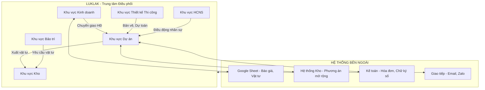

---
{"dg-publish":true,"permalink":"/luklak/solution/song-anh/00-tong-quan/","noteIcon":""}
---


# GIẢI PHÁP QUẢN TRỊ VẬN HÀNH SONG ANH

[Kinh doanh](./01-KHU-VUC-KINH-DOANH.md) | [Thiết kế](./02-KHU-VUC-THIET-KE.md) | [Dự án](./03-KHU-VUC-DU-AN.md) | [Kho](./04-KHU-VUC-KHO.md) | [Bảo trì](./05-KHU-VUC-BAO-TRI.md) | [HCNS](./06-KHU-VUC-HCNS.md)

---

## 1. Tóm tắt

Công ty Song Anh hiện đối mặt với các thách thức:

- Quy trình phân tán, thiếu liên thông giữa các phòng ban
- Khó kiểm soát chi phí phát sinh vật tư so với báo giá
- Thiếu hệ thống theo dõi tập trung cho BGĐ

**Giải pháp:** Sử dụng **Luklak** làm trung tâm điều phối, kết hợp các hệ thống khác để đáp ứng các nghiệp vụ đặc thù

---

## 2. Kiến trúc Hệ thống



---

## 3. Sơ đồ 6 Khu vực

```
HỆ THỐNG LUKLAK SONG ANH
│
├── 1. KHU VỰC KINH DOANH
│   ├── Mảng việc: Khách hàng & Cơ hội
│   ├── Mảng việc: Khảo sát
│   └── Mảng việc: Báo giá
│
├── 2. KHU VỰC THIẾT KẾ THI CÔNG
│   ├── Mảng việc: Thiết kế
│   ├── Mảng việc: Dự toán
│   └── Mảng việc: Bản vẽ kỹ thuật
│
├── 3. KHU VỰC DỰ ÁN
│   ├── Mảng việc: Hợp đồng
│   ├── Mảng việc: Dự án
│   └── Mảng việc: Nghiệm thu
│
├── 4. KHU VỰC KHO
│   ├── Mảng việc: Nhập/Xuất kho
│   ├── Mảng việc: Quản lý Máy móc
│   ├── Mảng việc: Quản lý Phương tiện
│   └── Mảng việc: Nhà cung cấp
│
├── 5. KHU VỰC BẢO TRÌ
│   ├── Mảng việc: Hợp đồng Bảo trì
│   ├── Mảng việc: Bảo trì Định kỳ
│   └── Mảng việc: Sự cố & Sửa chữa
│
└── 6. KHU VỰC HCNS
    ├── Mảng việc: Quản lý Nhân sự
    ├── Mảng việc: Quản lý Thời gian
    ├── Mảng việc: Quản lý Lương
    └── Mảng việc: Đánh giá & Tuyển dụng
```

---

## 4. Chi tiết từng Khu vực

| STT | Khu vực    | Tài liệu                                               | Mô tả                              |
| --- | ---------- | ------------------------------------------------------ | ---------------------------------- |
| 1   | Kinh doanh | [01-KHU-VUC-KINH-DOANH.md](./01-KHU-VUC-KINH-DOANH.md) | Khách hàng, Khảo sát, Báo giá      |
| 2   | Thiết kế   | [02-KHU-VUC-THIET-KE.md](./02-KHU-VUC-THIET-KE.md)     | Thiết kế, Dự toán, Bản vẽ kỹ thuật |
| 3   | Dự án      | [03-KHU-VUC-DU-AN.md](./03-KHU-VUC-DU-AN.md)           | Hợp đồng, Thi công, Nghiệm thu     |
| 4   | Kho        | [04-KHU-VUC-KHO.md](./04-KHU-VUC-KHO.md)               | Vật tư, Máy móc, Xe, NCC           |
| 5   | Bảo trì    | [05-KHU-VUC-BAO-TRI.md](./05-KHU-VUC-BAO-TRI.md)       | Bảo trì định kỳ, Sự cố             |
| 6   | HCNS       | [06-KHU-VUC-HCNS.md](./06-KHU-VUC-HCNS.md)             | Nhân sự, Lương, Tuyển dụng         |

**Tài liệu bổ sung:**

- [07-LIEN-THONG-KHU-VUC.md](./07-LIEN-THONG-KHU-VUC.md) - Kết nối xuyên Khu vực
- [08-TICH-HOP-HE-THONG.md](./08-TICH-HOP-HE-THONG.md) - Tích hợp hệ thống bên ngoài

---

